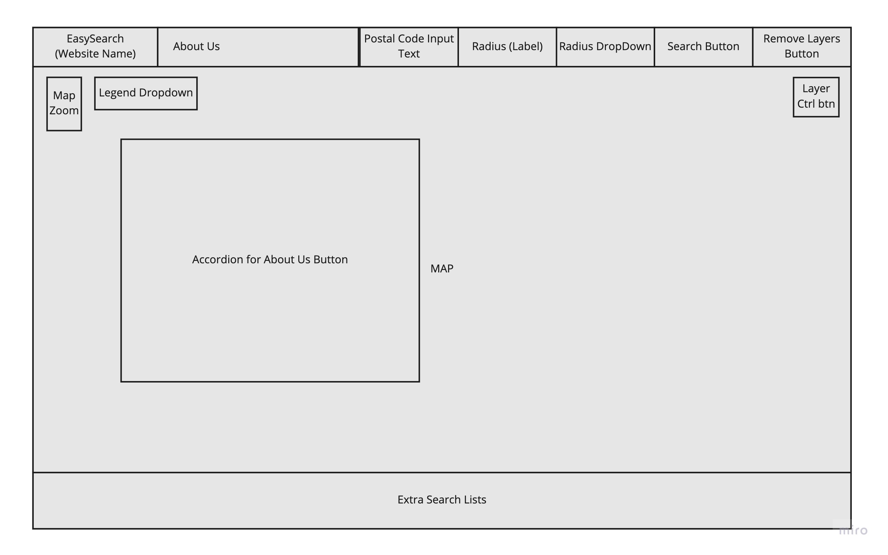
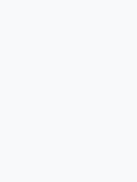

# **EASY SEARCH**
 
Access the live demo website [here]().

## **Overview**
---

The main purpose of this website is to aid users in their search of a HDB and discover the amenities around their potential/future house.

### **Target Audience**

The users mainly refer to resale HDB flat buyers and BTO/SBF flat buyers. 

Other types of home buyers (such as condominium or landed properties) may also find some features of the website to be applicable for their use.

Through the website, buyers should be able to make informed decisions on what their budget and price should be for the location and amenities around.

### **Organisation's Goals**

Organisation aims to promote awareness of the current HDB prices in Singapore to reduce the acceleration in prices of the HDB resale market. 

## **UIUX**
---
### **Strategy**

| User Stories | Acceptance Criteria | 
| ----------- | ----------- |
| As a resale flat/SBF/BTO buyer, I want to know what are the amenities around the flat block that I am considering. There is a certain distance that I want certain amenities to be within. User goal: to rationalise if the flat they are considering is a suitable location for them to stay in the next 0-10 years. | Based on the postal code and radius set by the user, the markers for the various categories of amenities will appear within the circle marker (radius indicator) upon the user's selection from the Layer Control.|
| As a resale flat buyer, I want to know what are the prices of the last transacted resale flat prices around the flat block that I am considering. User goal: To rationalise if the seller's asking price is high and if the location and amenities around is worth the price. | Based on the postal code and radius set by the user, markers for the last transacted resale flats around the considered flat block will appear within the circle marker (radius indicator).|
| As a resale flat buyer, I want to know the general prices of the resale flats for a certain flat type within a certain town. User goal: to determine if the flats in that town is within their budget for them to consider moving to. | Based on the Town and flat type selected, a list of the last transacted resale flats and its details by Town and flat type will appear. |
| As a resale flat/SBF/BTO buyer, I want to know if I qualify for the HDB Proximity Housing Grant, Your parents/ married child are living in an HDB flat or private residential property which is within 4km. | Based on the postal code and radius of 4km set by the user, the circle markers of their search results for the considered flat and parent's house should show if it overlaps or not. If it overlaps, it means they will qualify, otherwise, they are not eligible for it. |As part of HDB's Board, I am concerned with the fast increasing prices of resale HDB flats. User goal: to slow the growth of resale flat prices by allowing users to gain awareness of the general price paid by others in mature and non-mature estates.| Provide last transacted resale flat details (such as price, flat area etc) around their considered flat or by town and flat type. |

### **Scope**

### **Functional Requirements**

| Features | Content | 
| ----------- | ----------- |
|  Search for a location by postal code and set the radius (circle marker) | The searched location will be marked on the map and the circle marker indicating the radius will appear. The address of the searched location will be shown when you click on the marker |
|  Select the type of amenities or last transacted resale flats to show within the radius | The different type of amenities near the search location within the radius set will appear on the map with different marker icons. AMENITIES - the name and addresses will be shown when you click on the marker. LAST TRANSACTED RESALE FLATS - the month/year transacated, town, lease commencement year, price, flat type, flat area, flat level will be shown when you click on the marker.|
| Search for the list of last transacted resale flats by town and flat type. | A list of the last transacted resale flats will show. Types of details of the last transacted resale flats is the same as mentioned earlier.|

### **Non-Functional Requirements**
Performance Criteria
Mobile Responsiveness

### **Structure**

### **Skeleton**

### **Surface**

1. Colours
    - Used #f8f9fa an easy colour to read against
    - Used Bootstrap warning color for highlighting brand and important button
    - Used Boostrap success color for search button
    - Used Bootsrap secondary color for legend dropdown button for emphasis on the button
    - Used Bootstrap info color forthe FAQ accordion button to blend in with the map better.

    -   

2. Fonts
   - Used san-serif fonts from Google Fonts: "Urbanist" and "Anek Malayalam".
   - Bootstrap default fonts for components like buttons and accordion were used.

3. Icons
   - Used for markers and legend dropdown.

## **Technologies and Other Sources Used**

### **_Technologies_**
1. [GoogleFonts](https://fonts.google.com/) for CSS styling
2. [Axios](https://cdnjs.com/libraries/axios) for API requests
3. [Leaflet](https://leafletjs.com/examples/quick-start/) and [Marker Cluster](https://github.com/Leaflet/Leaflet.markercluster) for interactive map
   - Map, Markers, Layer Control, Marker Cluster
4. [W3schools](https://www.w3schools.com/) for HTML, CSS, Javascript
    - Collapsible
5. [Bootstrap](https://getbootstrap.com/docs/5.2/getting-started/introduction/) for HTML, CSS Styling
    - Buttons, Accordian, Table, Badge, Dropdown menu
    - Input group (Custom forms - Custom Select)
6. [Gitpod](https://gitpod.io/workspaces) for version control
7. [Github]() for code editing, local server and respository

### **_Data Sources_**

1. Data.gov.sg
   - [ResaleFlat Prices API](https://data.gov.sg/dataset/resale-flat-prices)
   - [Supermarkets Geojson](https://data.gov.sg/dataset/supermarkets)

2. Onemap.gov.sg
   - [REST APIs - Search](https://www.onemap.gov.sg/docs/#onemap-rest-apis)

3. Train source
   - [CSV File](https://data.world/)
   - [Conversion to JSON File](https://www.convertcsv.com/csv-to-json.htm)

4. Foursquare
   - [Place Search API](https://developer.foursquare.com/reference/place-search)
   - [Place Search Categories](https://developer.foursquare.com/docs/categories)

### **_Image Sources_**

|[Flaticon](https://www.flaticon.com/free-icons/) - Icon made by | Image name in gitpod |
| ---------------- | ----------- |
| surang | searchFlat.png |
| juicy_fish | supermarket.png|
| amonrat rungreangfangsai | primarySchool.png|
| Freepik | lastTransacted.png, train.png, secondarySchool.png, nursery.png, preschool.png, food.png|

### **_Other Sources_**
1. Lecturer (Paul Chor) for his slides, tutorials and notes
2. Teaching Assistants (Ace Liang, Lim Yong Sheng, Razia Wong) for their guidance
